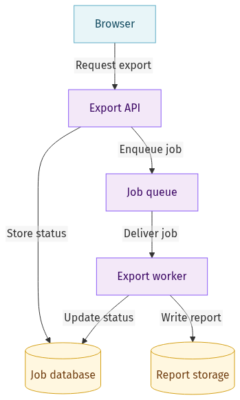
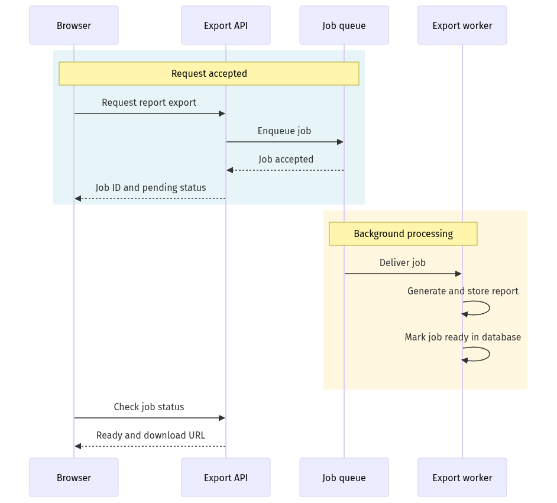
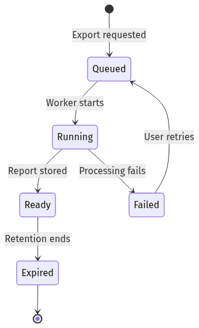

# Report export: sample gallery

Three views of a fictional report-export service for an engineering audience.
Assumptions: queued background work, a shared job database, stored report files,
user-triggered retry, and expiry after retention. These are examples, not a real system.

Open [index.html](index.html) locally to switch between PNG and SVG. GitHub displays
HTML source rather than running the gallery; the previews and links below work directly here.

| View | PNG | SVG | Editable source |
|---|---|---|---|
| Architecture | [PNG](01-architecture.png) | [SVG](01-architecture.svg) | [Mermaid](01-architecture.mmd) |
| Sequence | [PNG](02-sequence.png) | [SVG](02-sequence.svg) | [Mermaid](02-sequence.mmd) |
| State lifecycle | [PNG](03-state.png) | [SVG](03-state.svg) | [Mermaid](03-state.mmd) |

## Architecture

A compact vertical overview with explicit relationships and consistent service/data colors.



## Sequence

Four participants, with request acceptance separated from background completion.



## State lifecycle

A vertical layout with explicit failure, retry, and retention expiry.



## Recreate the exports

Start the Kroki stack, then run from the repository root:

```bash
for source in examples/report-export/*.mmd; do
  python3 skills/kroki/scripts/render.py "$source" --format both
done
```

PNG outputs have opaque white backgrounds. SVGs preserve vector shapes and text;
import support depends on the destination. Keep the Mermaid source for semantic edits.
